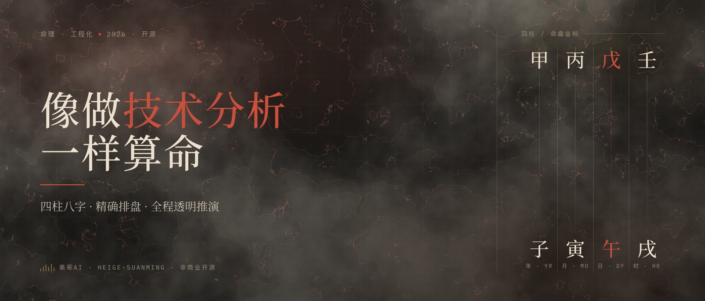

<div align="center">
  
</div>

# HeiGe-SuanMing

<div align="center">


**黑哥算命 · 八字/紫微命理排盘推演 + 占测引擎（梅花 · 六爻 · 奇门遁甲）| Bazi & Zi Wei Dou Shu destiny engines, plus Meihua, Liu Yao & Qi Men Dun Jia divination engines, that compute first, then reason**

像做技术分析一样算命：排盘、起卦、装卦交给脚本算准，推演按固定方法论逐层展开，每个结论都标注依据。

[这是什么](#这是什么-what-is-this) • [为什么不一样](#为什么不一样-why-its-different) • [核心方法论](#核心方法论-methodology) • [知识底座](#知识底座-knowledge-base) • [命盘样例](#命盘样例-sample) • [可视化命书](#可视化命书-visual-report) • [快速开始](#快速开始-quick-start) • [多 Agent 支持](#多-agent-支持-works-with-any-agent) • [免责声明](#免责声明-disclaimer)

</div>

---

## 这是什么 What is this

HeiGe-SuanMing 是一个**四柱八字命理引擎**，并内置**紫微斗数**第二命理引擎（批一生）与**梅花易数**、**六爻纳甲**、**奇门遁甲**三个占测引擎（占一时一事），能跑在任何"会读文件 + 能调 Python"的 AI Agent 里（推荐 Claude Code + Claude Opus 4.8）。八字部分把算命拆成两层：

**第一层：排盘用脚本算，绝不靠模型手推。**
`scripts/paipan.py` 基于 `lunar_python` 做精确干支推算，自动处理三件最容易错的事：以**立春**定年柱（不是正月初一）、以**节气**定月柱（不是农历月）、按**真太阳时**校正时柱。再往上算齐藏干、十神、纳音、长生十二宫、旬空、胎元命宫身宫、地支刑冲合会、五行力量加权、神煞、大运流年。

**第二层：推演按固定方法论走，结论必带依据。**
`SKILL.md` 规定了严密顺序：定旺衰 → 取用神 → 判格局 → 析岁运 → 落十神六亲 → 分维度断语。每一条断语后面都注明推理链（出自哪个十神、哪个宫位、哪步大运），孤证不立，中间推理全程透明。

一句话：**让排盘可复现、让推演有据可查。**

### 它能做什么

- ✅ **精确排盘**：立春定年、节气定月、真太阳时校正，闰月（负数月输入，如 `-2` = 闰二月）与子时流派可选，支持公历 1600-2200 年
- ✅ **旺衰量化**：五行力量加权打分，给出同党异党参考，再结合月令通根综合定档
- ✅ **取用神**：调候（穷通宝鉴）+ 扶抑 + 通关 + 病药，五法择用
- ✅ **判格局**：八格成败救应，从格 / 专旺 / 化气 / 魁罡等特殊格局核验
- ✅ **大运流年**：自动顺逆起运、逐步十神，引动用神还是忌神一目了然；可用 `--target-date` 把应期细到流月流日干支事实（断语止于月，不做每日吉凶）
- ✅ **分维度详断**：性格 / 事业 / 财运 / 婚姻 / 健康 / 学业 / 六亲，逐条带依据
- ✅ **趋避建议**：用神落到方位、颜色、行业、注意事项，务实不玄
- ✅ **养生调养**：按用神喜忌 + 寒暖燥湿体质，给针对性的作息、饮食、情志、运动建议，认准用神、缺啥补啥是误区，参考非医嘱
- ✅ **色彩服饰**：用神色落到衣着、首饰、配饰、随身物、居家办公，以颜色为主轴、宝石按色参考，审美优先、不承诺转运
- ✅ **合婚合参**：双盘对照夫妻星宫、用神互补、日柱年支合冲、大运同步，只断相处模式与磨合点，不打分、不下「合 / 不合」判词
- ✅ **可视化命书**：推演完成后自动生成一页东方雅致的 HTML 命书并直接打开，便于保存、回看、分享（断语与文字版逐字一致，只要文字版说一声即可）
- ✅ **梅花易数占卜（第二引擎）**：时间 / 数字 / 物象起卦，脚本算准本卦互卦变卦与体用定位，按体用生克断一件事的顺逆与过程，占卜非命理、一事一占、趋势化不打分
- ✅ **六爻纳甲占卜（第三引擎）**：摇卦装卦全交脚本（纳甲干支、八宫世应、六亲、六神、动变卦、月建日辰旬空），按用神旺衰与动静生克细断一事，装卦定式以京房体系回归测试钉死
- ✅ **紫微斗数安星（第五引擎）**：十二宫定位、五行局、紫微天府双星系、四化、六吉六煞、大限小限全交脚本算准，全部公式用开源实现 iztro 的真实测试用例交叉验证（40+ 数值核验点，39 项精确吻合）
- ✅ **奇门遁甲排局（第六引擎）**：时家转盘排局全交脚本（拆补法定局、地盘三奇六仪、旬首值符值使、天盘九星、八门飞宫、八神、旬空驿马伏吟反吟），全部公式经四个独立实现交叉核验，两个逐宫黄金盘进回归测试，流派分歧逐处裁决并标注

### 适合谁

- 想认真研究八字、对**推理过程透明度**有要求的人
- 算过命但受够了"铁口直断、只给结论不给依据"的人
- 想用一套**可复现、可审计**的方式做自我认知参考的人

---

## 为什么不一样 Why it's different

市面上的算命，痛点通常在两头：排盘容易算错，推演无从复盘。这个引擎把两头都钉死。

| 维度 | 手推 / 普通 AI 算命 | HeiGe-SuanMing |
|---|---|---|
| **排盘** | 常错在正月初一定年、农历月定月、忽略真太阳时 | 脚本精确推算，立春定年 + 节气定月 + 真太阳时校正 |
| **旺衰** | 拍脑袋说身强身弱 | 五行加权打分 + 月令通根综合，临界值回到细节辨 |
| **结论** | 铁口直断，只给结果 | 每条断语标注推理链，出自哪个十神 / 宫位 / 用神 |
| **佐证** | 单一信号就下死断 | 一象多看，至少两处佐证（星 + 宫，或 原局 + 岁运） |
| **过程** | 黑箱，无法复盘 | 旺衰打分、取用逻辑、格局成败全程展示 |
| **语气** | 承诺祸福、贩卖焦虑 | 趋势化表达（易 / 倾向 / 利于 / 需注意），落到趋避建议 |

核心差别就一句：**它把"为什么这么断"全摊开给你看。**

---

## 核心方法论 Methodology

引擎遵循一套固定顺序，**先定旺衰用神，再谈一切**，顺序不可乱：

```
第 0 步  收集确认输入（阳历/农历、时间、性别、出生地经度）
第 1 步  精确排盘：运行 paipan.py，完整命盘呈现为事实基础
第 2 步  读盘定盘面：日主、月令、地支刑冲合会逐一标出
第 3 步  判旺衰：月令 / 通根 / 生扶 / 党众 / 定档（五看）
第 4 步  取用神：调候 ≥ 扶抑 > 通关 > 病药（五法）
第 5 步  判格局：八格取法、成败救应、特殊格局核验
第 6 步  析岁运：大运流年引动用神还是忌神，定应期
第 7 步  落宫位：十神六亲落年月日时，看刑冲合害
第 8 步  分维度：性格/事业/财运/婚姻/健康/学业/六亲，逐条带依据
第 9 步  趋避与调养：用神落到方位、行业，再给色彩服饰（穿戴随身环境）与作息饮食情志的个性化建议
第 10 步 总评：3-5 句收束命局核心结构与一生大势
第 11 步 可视化：（默认交付）把整份命书自动做成一页 HTML 报告，给出路径并直接打开
第 12 步 主动推进：（默认）交付后主动列一份清单，问要不要往下做（合婚/流年/单维度深挖/养生色彩详单/紫微详参/起卦占事），选了才做
```

> **交互范式：核心自动跑到底，延伸功能主动列清单问一次。** 给了生辰就一路排盘→推演→出 HTML 直接交付，中途不打断；核心命书给完后，再主动递一份「还能往下做什么」的简明清单让你挑，选了才做。既不闷头停下什么都不提，也不默认全铺开塞满一屏。

知识底座放在 `references/`，推演时按需调用：

| 文件 | 内容 |
|---|---|
| `00_gainian_suoyin.md` | 概念→篇目检索索引：按推演步骤 / 核心概念 / 典籍溯源定位该读哪篇，不知看哪篇先查这里 |
| `01_paipan_jichu.md` | 干支五行阴阳、地支藏干、十神生成、长生十二宫、刑冲合害会 |
| `02_wangshuai_yongshen.md` | 旺衰五看、取用神五法、**流派仲裁决策树**（多用神候选听谁的）、用神喜忌定义、常见误区 |
| `03_tiaohou_qiongtong.md` | 穷通宝鉴十干分十二月调候用神速查表 |
| `04_shishen_xiangyi.md` | 十神类象、四柱宫位、六亲取用、分维度断法 |
| `05_geju.md` | 八格取法、成败救应、从格 / 专旺 / 化气等特殊格局 |
| `06_shensha.md` | 常用神煞查法、吉凶象义、使用原则 |
| `07_keshihua_baoshu.md` | 可视化命书：默认交付时机与输出规范、HTML 结构模板、字体可靠性铁律、五行配色映射 |
| `08_gufu_duanyu.md` | 古籍赋文经验断语：渊海 / 三命 / 神峰赋诀分维度精选，短引＋白话＋调用提示 |
| `09_shenfeng_tongkao.md` | 神峰通考：病药说、动静说、盖头截脚、伤官伤尽辨、十干体象、辟谬批判 |
| `10_mingli_yueyan.md` | 命理约言理性派：生克扶抑总纲、用神精神说、格局正变、神煞纳音小运胎元祛魅清单 |
| `11_sanming_tonghui.md` | 三命通会：旺相休囚死五态、寄生十二宫体用、十神立名、格局神煞集成纲目、大运太岁取法 |
| `12_dianji_yuanliu.md` | 典籍源流导航：宋明清民国 12 部命书的贡献、对应篇目、公版出处与调用路径 |
| `13_ditian_sui.md` | 滴天髓：衰旺真机、中和为贵、体用精神、极旺极衰辩证、气势顺逆通关、寒暖燥湿、任注实证 |
| `14_ziping_zhenquan.md` | 子平真诠：月令取格、顺逆取用、相神护格、成败救应、格局高低、用神变化、行运同看 |
| `15_yangsheng_tiaoyang.md` | 五行养生调养：把用神喜忌、缺失、过旺、寒暖燥湿，翻译成针对性的作息、饮食、情志、运动建议（认准用神，缺啥补啥是误区，参考非医嘱） |
| `16_secai_fushi.md` | 色彩服饰调候：把用神喜忌、寒暖燥湿，翻译成针对性的衣着、首饰、配饰、随身物、居家办公色彩与材质（认用神色，缺啥穿啥是误区；颜色为主轴、宝石按色参考不神化，参考非转运） |
| `17_hehun.md` | 正派合婚双盘合参：双方婚姻象 + 用神互补 + 日柱年支合冲 + 大运同步，只断相处模式与磨合点（禁打分、禁「合 / 不合」判词；属相相冲一票否决、合婚煞法等旧法不取） |
| `18_meihua_yishu.md` | 梅花易数占卜引擎（第二引擎，非命理）：起卦法、先天八卦数、体用生克断事、互变卦、卦气应期、八卦万物类象、《梅花易数》源流（占卜非命理、一事一占、不打分，配 `scripts/meihua.py`） |
| `19_liuyao.md` | 六爻纳甲占卜引擎（第三引擎，非命理）：摇卦装卦、纳甲八宫世应六亲六神、取用神六亲对照、旺衰动静生克、空亡月破应期、京房至《增删卜易》源流（配 `scripts/liuyao.py`） |
| `20_ziwei.md` | 紫微斗数安星引擎（第五引擎，命理）：十二宫定位、命宫干支五行局、紫微天府双星系（含天府定位公式纠错）、四化、六吉六煞、大限小限，全部公式经开源实现 iztro 真实测试用例交叉验证（配 `scripts/ziwei.py`；本版止于安星层） |
| `21_qimen.md` | 奇门遁甲排局引擎（第六引擎，占测）：时家转盘排局（拆补法定局、72 局表、三元符头公式、地盘三奇六仪、旬首值符值使、天盘九星、八门飞宫、八神、旬空驿马伏吟反吟），全部公式经四个独立实现交叉核验，拆补/置闰与寄宫等流派分歧逐处裁决标注（配 `scripts/qimen.py`；本版止于排局层） |

其中 `00` 是概念检索入口，`01-07` 是推演主干，`08-14` 是经典典籍深化层，把方法论锚回《渊海子平》《滴天髓》《穷通宝鉴》《子平真诠》《三命通会》《神峰通考》《命理约言》等原典，《滴天髓》《子平真诠》两大主干更各有专篇（`13`、`14`）；`15`、`16` 是第 9 步的调养落地篇，把用神喜忌翻译成作息饮食情志（`15`）与色彩服饰（`16`）建议，`17` 是正派合婚双盘合参篇，`18`、`19`、`21` 是占测引擎（梅花易数、六爻纳甲、奇门遁甲，占一时一事，与八字命理分属不同门类），`20` 是紫微斗数命理引擎（批一生，本版止于安星层）。这一层结构化、带出处、可直接读取，任何模型（不限于 Claude）接上 `references/` 都能据此推演，断准度有据可依。古籍多托名辑录，文中凡有争议处均标「存疑」，引用前先认版本。

---

## 知识底座 Knowledge Base

算得准的前提是**有典可循、有例可照、有测可验**。这套引擎的底座做了四件事，让推演经得起追问：

**一、把方法论锚回原典。** `references/08-14` 七篇深化层，把每个论断都接回《渊海子平》《滴天髓》《穷通宝鉴》《子平真诠》《三命通会》《神峰通考》《命理约言》。旺衰中和派的《滴天髓》（`13`）与格局派的《子平真诠》（`14`）两大主干各立专篇，原文＋白话＋调用提示俱全，引用前先认版本、争议处标「存疑」，孤证不立。

**二、四个完整命例照着学。** `cases/` 收了 4 个脱敏命例，覆盖 4 个日主、4 种旺衰结构（身强用财官 / 身弱用印比 / 调候为急 / 从格顺势）。每例都是 `paipan.py` 实跑真盘＋第 0 到 10 步走全＋每条断语带依据，是把方法论落到一个真盘的最佳模板。

**三、多用神冲突有决策树仲裁。** 调候、扶抑、格局、病药各执一词时该听谁的？`references/02` 给了一条五级优先级阶梯（先验从格 → 再急调候 → 扶抑定向 → 格局定点 → 病药校验），把流派之争收敛成一套可执行的取舍顺序。

**四、排盘精度有回归测试兜底。** `tests/` 共 261 个测试（八字 114 + 梅花 30 + 六爻 29 + 紫微 42 + 奇门 46）。八字以命理古法定式为基准真值校验十神、藏干、长生、刑冲合会、神煞（含天德四个地支月与输出定序），再用立春换年柱、节气换月柱、流年立春分界、子时流派（两派时干钉死）、大运顺逆、真太阳时（含农历叠加）、闰月、流月流日节气换月、合婚双盘对照、夏令时核时、年份边界、输入校验等边界；梅花以《梅花易数》「观梅占」黄金例校验起卦全链路（先天数取卦、互卦、变卦、体用生克）；六爻以京房定式钉死纳甲干支、八宫世应（含游魂归魂）、六亲配法与六神起法；紫微以开源实现 iztro 的真实测试用例为黄金案例，十二宫十四主星四化六吉六煞大限小限逐项核对；奇门以四个独立实现交叉的两个逐宫黄金盘钉死排局全链路，另锁交气时刻粒度、23 点换日、值使从中五起数三处最易错边界。改动脚本后跑 `python3 -m unittest discover -s tests`，全绿再用。

---

## 命盘样例 Sample

输入 `1990 年 5 月 15 日 14:30 男`，脚本输出（节选）：

```
════════════════════ 八字命盘 ════════════════════
公历：1990-05-15 14:30　性别：男　生肖：马　星座：金牛
农历：一九九〇年四月廿一
节气：立夏（1990-05-06）后第 9 天，下一节气 小满
夏令时：出生于 1990 年中国夏令时实施期（4/15–9/16，钟表较北京标准时快 1 小时）。若所记为当时钟表时间，真实时间应减 1 小时再定时柱，请核对。

【四柱】     年柱    月柱    日柱    时柱
  天干十神   比肩    劫财    日主    伤官  
  天干       庚(金)    辛(金)    庚(金)    癸(水)
  地支       午(火)    巳(火)    辰(土)    未(土)
  藏干       丁己     丙戊庚    戊乙癸    己丁乙  
  藏干十神   正官/正印   七杀/偏印/比肩   偏印/正财/伤官   正印/正官/正财  
  星运       沐浴      长生      养       冠带  
  纳音       路旁土    白蜡金    白蜡金    杨柳木  
  旬空       戌亥      申酉      申酉      申酉  

【日主】庚金，生于 巳（火） 月令
【胎元】壬申　【命宫】辛巳　【身宫】己丑

【地支刑冲合会】
  六合：年午·时未→合火/土
  三会：巳午未三会火方(年午·月巳·时未)

【五行个数】木0　火2　土2　金3　水1　｜缺：木
【五行力量】（天干1 / 藏干本气1·中气0.5·余气0.2 / 月支司令×2）
  木:0.7  火:3.5  土:3.5  金:3.4  水:1.2
  同党(扶日主)=6.9  [比劫(金)3.4 + 印(土)3.5]
  异党(耗日主)=5.4  [食伤(水)1.2 + 财(木)0.7 + 官杀(火)3.5]
  同党占比 56% → 量化参考：偏强（最终旺衰须结合月令得失·通根透干·刑冲合会综合判断）

【神煞】天乙贵人(时)　天德贵人(月)　月德贵人(年·日)　将星(年)　华盖(日)　魁罡(日)　寡宿(日)

【大运】顺排　8岁起运（虚岁，1997-08-04）
  幼运 1-7岁（1990-）
  壬午　 8-17岁　1997年起　[食神/正官/正印]　星运:沐浴
  癸未　18-27岁　2007年起　[伤官/正印/正官/正财]　星运:冠带
  甲申　28-37岁　2017年起　[偏财/比肩/食神/偏印]　星运:临官
  ……（后续大运与流年略）
```

脚本只负责把这些**事实**算准。拿到命盘后，Claude 再按方法论逐层推演旺衰、用神、格局、岁运，给出带依据的断语。

---

## 可视化命书 Visual Report

<p align="center">
  <a href="https://raw.githack.com/HeiGeAi/HeiGe-SuanMing/main/examples/%E7%A4%BA%E4%BE%8B-%E5%85%AB%E5%AD%97%E5%91%BD%E4%B9%A6.html"></a>
  <br><sub>点图在线预览完整命书长卷 · 卷首命格诗四句点出命局核心（虚拟生辰演示）</sub>
</p>

文字推演（第 0–10 步）给完之后，引擎会直接把整份命书做成**一页可视化 HTML** 端到你面前：写入工作目录、给出路径、能打开就顺手帮你打开。只想要文字版，说一声就停在文字版。

它把文字推演原样"呈现"成一卷东方雅致的命书长卷，不为排版另造任何结论：

- **一页长卷**：卷首命格诗、命盘全图、五行能量条、旺衰用神、大运时间轴、流年逐年、分维度详断、趋避清单、色彩服饰、养生调养、综合总评，一屏一主角顺次铺开
- **签名时刻**：把命局命门（最关键的用神或缺神）单字放大成全屏主视觉，一眼记住这盘的钥匙
- **字体零塌**：思源宋体为骨架、系统宋体兜底，断网或加载失败也工整不掉字；层次靠字重拉开，不赌未必预装的书法体
- **依据随行**：每个断语块保留依据标签（如 `伤官透月干为用`），与文字版推理链逐字一致
- **可脱敏**：对外分享可换虚构生辰重新排盘、断语写通用向，不留可对号入座的隐私

<p align="center">
  <a href="https://raw.githack.com/HeiGeAi/HeiGe-SuanMing/main/examples/%E7%A4%BA%E4%BE%8B-%E5%85%AB%E5%AD%97%E5%91%BD%E4%B9%A6.html"></a>
  <br><sub>签名时刻：本例满盘五火、独缺一水，命门「水」单字放大成全屏，过目不忘（点图在线预览）</sub>
</p>

想看完整效果，点 **[在线预览](https://raw.githack.com/HeiGeAi/HeiGe-SuanMing/main/examples/%E7%A4%BA%E4%BE%8B-%E5%85%AB%E5%AD%97%E5%91%BD%E4%B9%A6.html)**（raw.githack 实时渲染，无需克隆；在 GitHub 上直接点 `.html` 只会看到源码，这是 GitHub 不渲染网页的限制）。源码见 [`examples/示例-八字命书.html`](./examples/示例-八字命书.html)，方法论与结构模板见 [`references/07_keshihua_baoshu.md`](./references/07_keshihua_baoshu.md)。

> 文字推演是根，可视化只是锦上添花。没有完整的第 0–10 步文字推演，不直接出 HTML。

---

## 快速开始 Quick Start

下面是**推荐路径：Claude Code**。用 Codex / Cursor / Cline 等其他 Agent 的，跳到 [多 Agent 支持](#多-agent-支持-works-with-any-agent)。

### 1. 安装技能

把技能克隆到 Claude Code 的 skills 目录：

```bash
git clone https://github.com/HeiGeAi/HeiGe-SuanMing.git ~/.claude/skills/bazi-mingli
```

### 2. 装好排盘依赖

```bash
pip3 install -r ~/.claude/skills/bazi-mingli/requirements.txt
# 或者直接：pip3 install lunar_python
```

### 3. 在 Claude Code 里用

输入 `/bazi-mingli`，然后把生辰丢给它：

```
/bazi-mingli

> 帮我看看：1990 年 5 月 15 日下午 2 点半出生，男，出生地广州
```

需要的信息：**阳历或农历的年月日时 + 性别**。出生地（经度）可选，用于真太阳时校正。不知道出生时间也能排，但时柱主子女与晚年，缺失会声明局限。

### 直接跑脚本（可选）

五个引擎脚本都可以脱离对话单独运行：

```bash
# 八字排盘
python3 ~/.claude/skills/bazi-mingli/scripts/paipan.py 1990 5 15 14 30 --gender male --lng 113.3
# 梅花易数起卦（数字起卦占一件事）
python3 ~/.claude/skills/bazi-mingli/scripts/meihua.py --numbers 34 43 --query "问近期求职"
# 六爻装卦（摇卦结果自初爻向上，6=老阴动 7=少阳 8=少阴 9=老阳动）
python3 ~/.claude/skills/bazi-mingli/scripts/liuyao.py --yao 787888 --date 2026 6 15
# 紫微斗数安星
python3 ~/.claude/skills/bazi-mingli/scripts/ziwei.py 2000 8 16 3 30 --gender female
# 奇门遁甲排局（时家转盘·拆补法）
python3 ~/.claude/skills/bazi-mingli/scripts/qimen.py 2026 7 9 10 30
```

八字常用选项：`--lunar`（按农历，闰月用负数月表示，如 `-2` = 闰二月）、`--lng <经度>`（真太阳时，范围 -180~180，东经正西经负）、`--tz <时区偏移>`（出生地时区，默认 +8，配合 `--lng` 使用）、`--years <起始年> <年数>`（流年区间，默认从当前干支年按立春分界起 10 年）、`--target-date <年 月 日>`（指定日流年流月流日干支事实，断语止于月）、`--partner <年 月 日 时 [分]>` 配 `--partner-lunar` / `--partner-gender`（合婚双盘对照，乙方历法独立声明）、`--json`（结构化输出）、`--zi-sect <1|2>`（子时流派）。支持公历 1600-2200 年，起运岁数按虚岁口径，1986-1991 夏令时期出生自动提示核时。

---

## 多 Agent 支持 Works with any agent

技能核心是一层文本加三个脚本，**不绑定任何特定 Agent**：`SKILL.md`（方法论指令）+ `scripts/`（paipan 排盘、meihua 起卦、liuyao 装卦三个引擎）+ `references/`（术数知识底座）。任何"能读本地文件 + 能跑 Python"的 AI Agent，都能驱动它排盘推演与起卦断事。

先做通用两步：

```bash
# 1. 克隆到本地任意目录
git clone https://github.com/HeiGeAi/HeiGe-SuanMing.git

# 2. 安装排盘依赖
pip3 install -r HeiGe-SuanMing/requirements.txt
```

第三步，把这段指引接进你的 Agent 规则文件：

```text
排八字时严格遵循 HeiGe-SuanMing/SKILL.md 的十二步方法论；
排盘一律调用 HeiGe-SuanMing/scripts/paipan.py，不靠模型手推；
每条断语必须标注推理依据，孤证不立。
```

规则文件位置因 Agent 而异：

<details>
<summary><b>Codex（OpenAI）</b></summary>

写进项目根目录的 `AGENTS.md`，或全局 `~/.codex/AGENTS.md`。Codex 启动时自动加载，之后直接说"排个八字"即可。
</details>

<details>
<summary><b>Cursor</b></summary>

在 `.cursor/rules/` 下新建一条规则文件（`.mdc`），或写进项目根目录的 `.cursorrules`。
</details>

<details>
<summary><b>Cline</b></summary>

写进工作区根目录的 `.clinerules`（单文件或同名文件夹均可）。
</details>

<details>
<summary><b>Windsurf</b></summary>

写进 `.windsurf/rules/` 下的规则文件，或旧版 `.windsurfrules`。
</details>

<details>
<summary><b>Continue</b></summary>

把克隆目录加入上下文，并在 `config` 的 `rules` 里补一条上面的指引。
</details>

<details>
<summary><b>GitHub Copilot</b></summary>

写进 `.github/copilot-instructions.md`，对整个仓库生效。
</details>

<details>
<summary><b>通用方式（任意 Agent）</b></summary>

不依赖规则文件也行：直接对 Agent 说"读取 HeiGe-SuanMing/SKILL.md 并严格按它执行，排盘调用 scripts/paipan.py、起卦调用 scripts/meihua.py、装卦调用 scripts/liuyao.py、安星调用 scripts/ziwei.py、排局调用 scripts/qimen.py"，它就能照着跑。五个引擎脚本本身也能脱离对话单独运行（见上方[快速开始](#快速开始-quick-start)）。
</details>

### 为什么推荐 Claude Code + Claude Opus 4.8

能跑归能跑，但**最佳体验仍然是 Claude Code 搭 Claude Opus 4.8**。

八字推演不是查表，是一条长链推理：旺衰要综合月令通根党众、取用神要权衡调候扶抑、格局要判成败救应、岁运要看引动喜忌，每一步都依赖前一步的结论，还要全程"一象多看、孤证不立"。这种**多层嵌套、需要稳定保持长链逻辑**的任务，对模型推理深度要求很高。实测下来，Claude Opus 4.8 在保持方法论纪律、不丢依据、不下无据死断这几点上明显更稳。

---

## 项目结构 Architecture

```
HeiGe-SuanMing/
├── SKILL.md                      # 主提示词：十二步方法论与输出结构（你的 Agent 读这个）
├── scripts/
│   ├── paipan.py                 # 八字精确排盘引擎（基于 lunar_python）
│   ├── meihua.py                 # 梅花易数起卦引擎（先天八卦数+互变+体用）
│   ├── liuyao.py                 # 六爻装卦引擎（纳甲+八宫世应+六亲+六神）
│   ├── ziwei.py                  # 紫微斗数安星引擎（十二宫+五行局+双星系+四化）
│   └── qimen.py                  # 奇门遁甲排局引擎（时家转盘·拆补法定局+星门神）
├── references/                   # 命理知识底座，推演时按需调用
│   ├── 00_gainian_suoyin.md      # 命理概念 → 篇目检索索引（先看这里再按需深读）
│   ├── 01_paipan_jichu.md
│   ├── 02_wangshuai_yongshen.md  # 含取用神四派仲裁决策树
│   ├── 03_tiaohou_qiongtong.md
│   ├── 04_shishen_xiangyi.md
│   ├── 05_geju.md
│   ├── 06_shensha.md
│   ├── 07_keshihua_baoshu.md     # 可视化命书：一页 HTML 报告产出规范
│   ├── 08_gufu_duanyu.md         # 古籍赋文经验断语：渊海 / 三命 / 神峰赋诀精选
│   ├── 09_shenfeng_tongkao.md    # 神峰通考：病药说、动静说、盖头截脚、十干体象
│   ├── 10_mingli_yueyan.md       # 命理约言：理性派论法与祛魅清单
│   ├── 11_sanming_tonghui.md     # 三命通会：旺衰五态、十二宫、十神、格局神煞纲目
│   ├── 12_dianji_yuanliu.md      # 典籍源流与调用路径导航地图
│   ├── 13_ditian_sui.md          # 滴天髓：衰旺真机、中和、体用精神、寒暖燥湿
│   ├── 14_ziping_zhenquan.md     # 子平真诠：月令顺逆、相神、成败救应、格局高低
│   ├── 15_yangsheng_tiaoyang.md  # 五行养生调养：用神喜忌落到作息饮食情志运动
│   ├── 16_secai_fushi.md         # 色彩服饰调候：用神色落到衣着首饰随身环境
│   ├── 17_hehun.md               # 正派合婚双盘合参：用神互补+日柱年支合冲，不打分
│   ├── 18_meihua_yishu.md        # 梅花易数占卜引擎：起卦+体用+互变，占一时一事
│   ├── 19_liuyao.md              # 六爻纳甲占卜引擎：装卦+用神+旺衰生克应期
│   ├── 20_ziwei.md               # 紫微斗数安星引擎：十二宫+双星系+四化，命理批一生
│   └── 21_qimen.md               # 奇门遁甲排局引擎：定局+布盘+值符值使，占一时一事
├── cases/                        # 完整推演范例，照着学怎么把方法落到真盘
│   ├── 01_shenqiang_caiguan.md   # 身强用财官
│   ├── 02_shenruo_yinbi.md       # 身弱用印比
│   ├── 03_tiaohou.md             # 调候为急
│   └── 04_conge.md               # 从格顺势
├── tests/
│   ├── test_paipan.py            # 八字排盘回归测试（古法定式为基准）
│   ├── test_meihua.py            # 梅花起卦回归测试（观梅占黄金例）
│   ├── test_liuyao.py            # 六爻装卦回归测试（京房纳甲定式）
│   ├── test_ziwei.py             # 紫微安星回归测试（iztro 真实实现黄金案例）
│   └── test_qimen.py             # 奇门排局回归测试（四源交叉逐宫黄金盘）
├── examples/
│   └── 示例-八字命书.html         # 可视化命书样例（虚拟生辰，脱敏教学向）
├── assets/
│   ├── cover.png                 # README 题图
│   ├── visual-hero.jpg           # 可视化命书 · 卷首命格诗
│   └── visual-sig.jpg            # 可视化命书 · 签名时刻
├── requirements.txt
├── LICENSE
└── README.md
```

## 系统要求 Requirements

- 任意"能读文件 + 跑 Python"的 AI Agent（推荐 Claude Code + Claude Opus 4.8）
- Python 3.7+
- `lunar_python >= 1.4.0`

---

## English

**HeiGe-SuanMing** is a Bazi (Four Pillars of Destiny) engine that runs inside any AI agent able to read local files and run Python (Claude Code + Claude Opus 4.8 recommended). It splits fortune-telling into two layers so the whole thing stays reproducible and auditable. It also ships a second destiny-reading engine — **Zi Wei Dou Shu (Purple Star Astrology)**, full star-chart assembly (twelve palaces, Five Elements bureau, the Ziwei/Tianfu star systems, the Four Transformations, lucky/unlucky stars, decade and annual limits), cross-validated against a real open-source implementation's test fixture — plus three divination engines — **Meihua Yishu (Plum Blossom I-Ching)**, **Liu Yao (Najia hexagram casting with full chart assembly: stems-and-branches, palace, Shi/Ying, six relatives, six spirits)**, and **Qi Men Dun Jia (hour-based rotating-plate chart casting: yin/yang cycle and bureau, earth plate, Duty Chief star and gate, nine stars, eight gates, eight deities, cross-validated against four independent implementations)** — for working one specific question (distinct from life-reading).

**Layer 1 — the chart is computed, never hand-derived.** `scripts/paipan.py` uses `lunar_python` for precise stem-branch calculation, automatically handling the three things people get wrong most often: setting the year pillar by **Lichun** (start of spring, not lunar new year), the month pillar by **solar terms** (not the lunar month), and the hour pillar by **true solar time**. On top of that it computes hidden stems, ten gods, nayin, the twelve life stages, void branches, branch interactions (combinations / clashes / punishments), weighted five-element strength, symbolic stars, and the luck/annual pillars.

**Layer 2 — the reading follows a fixed methodology, every claim cites its basis.** `SKILL.md` enforces a strict order: strength → useful god → structure → luck cycles → ten-gods/relatives → dimensional readings → guidance plus personalized health-cultivation and color/attire advice (lifestyle, diet, rest, and what to wear, tuned to the useful god, not folk "supplement what's missing"). Each statement notes its reasoning chain, no single-signal verdicts, full reasoning shown.

**Grounded in the classics, checked by tests.** The `references/` knowledge base anchors every method back to the canonical texts — Yuanhai Ziping, Ditian Sui, Qiongtong Baojian, Ziping Zhenquan, Sanming Tonghui, and more — with the two pillars (Ditian Sui and Ziping Zhenquan) each given a dedicated chapter. `cases/` ships four fully worked, desensitized readings across four day-masters and four strength structures, and `tests/` locks all five engines with 261 regression tests (Bazi 114 + Meihua 30 + Liu Yao 29 + Zi Wei Dou Shu 42 + Qi Men Dun Jia 46) against classical ground truth plus edge cases (Lichun, solar terms, leap months, midnight conventions, luck-cycle direction, true solar time, monthly/daily fleeting pillars, compatibility pairing, China DST, year bounds, input validation, the classic Guanmei hexagram casting, the Jing Fang Najia canon, a real open-source implementation's test fixture for the Zi Wei star chart, and two palace-by-palace Qi Men golden charts cross-checked across four independent implementations).

**A one-page visual report, delivered by default.** Once the reading is done, the engine automatically renders the whole thing into a single elegant HTML scroll and opens it for you (just say so if you only want the text version): chart, five-element bars, luck timeline, dimensional readings, personalized health-cultivation and color/attire advice, and a full-screen close-up of the chart's pivotal element. The text stays verbatim-identical to the reading, and fonts fall back gracefully so nothing breaks offline. See the [live preview](https://raw.githack.com/HeiGeAi/HeiGe-SuanMing/main/examples/%E7%A4%BA%E4%BE%8B-%E5%85%AB%E5%AD%97%E5%91%BD%E4%B9%A6.html), built from a fictional birth date. (GitHub serves `.html` as source, so use this link rather than opening the file directly.)

**Runs anywhere, tuned for Claude Code.** The core is just text plus a script — `SKILL.md` (methodology), `scripts/paipan.py` (chart engine), and `references/` (knowledge base) — so any agent that reads local files and runs Python can drive it (Codex, Cursor, Cline, Windsurf, Continue, Copilot, and so on): clone the repo, install deps, and point the agent's rules file at `SKILL.md`. That said, the best experience is **Claude Code + Claude Opus 4.8** — Bazi reasoning is one long dependent chain, and Opus is noticeably steadier at holding methodological discipline and never dropping the evidence behind a verdict.

Claude Code setup:

```bash
git clone https://github.com/HeiGeAi/HeiGe-SuanMing.git ~/.claude/skills/bazi-mingli
pip3 install -r ~/.claude/skills/bazi-mingli/requirements.txt
```

Then type `/bazi-mingli` in Claude Code and give it a birth date, time, and gender. For other agents, see the [多 Agent 支持](#多-agent-支持-works-with-any-agent) section above.

---

## 免责声明 Disclaimer

本项目是对**中国传统命理学（四柱八字）的数字化整理与研究工具**，定位为传统文化学习与自我认知的参考，供研究、学习、自省之用。

- 命理推演是基于经典模型的**倾向性、概率性分析**，不构成对任何人命运、健康、婚姻、财富的预言或保证。
- 本工具**不宣扬封建迷信**，不承诺改运、消灾、转运，不提供任何形式的趋吉避凶"法术"。
- 所有结论仅供参考。涉及健康、婚姻、投资、职业等真实人生决策，请以现实情况为准，结合专业意见理性判断。
- 请勿将本工具用于任何违法用途，或借命理之名行欺诈、敛财、制造焦虑之实。

This project is a research and study tool for traditional Chinese metaphysics (Bazi). Its readings are probabilistic, model-based tendencies, not predictions or guarantees. It does not promise to change fate or ward off misfortune. For real-life decisions, rely on reality and professional advice.

---

## 致谢 | Credits

由 [@blakexu](https://github.com/blakexu) 打造。排盘精度由 [lunar_python](https://github.com/6tail/lunar-python) 提供支撑。方法论参考《渊海子平》《滴天髓》《穷通宝鉴》《子平真诠》《三命通会》《神峰通考》《命理约言》等命理经典，源流与公版出处见 [`references/12_dianji_yuanliu.md`](./references/12_dianji_yuanliu.md)。

## 许可证 | License

PolyForm Noncommercial 1.0.0 © 2026 [HeiGeAi (Blake Xu)](https://github.com/HeiGeAi)

本项目源码公开，但采用 **PolyForm Noncommercial License 1.0.0**，是一个"开源 + 限定非商业用途"的协议。要点：

1. **非商业使用免费**：个人研究、学习、自用、兴趣项目，随便用、随便改、随便分享
2. **必须保留署名**：二开、Fork、再分发都要保留版权与来源声明，别去掉署名冒充原创
3. **禁止任何商业用途**：不得用于盈利产品、付费服务、商业化分发，或任何带商业目的的场景；**未经授权的商业化即视为违反本协议**
4. **商用须先授权**：想商用？先开 Issue 或私信作者单独谈授权，谈拢了再用

完整法律条款见 [`LICENSE`](./LICENSE)。代码开源，理性看命。

**English:** This project is source-available under **PolyForm Noncommercial 1.0.0** — free for any noncommercial use (study, research, personal projects), with attribution required. **Any commercial use requires a separate license from the author** (open an Issue or reach out). Unauthorized commercial use violates the license.

## 更多开源工具

本项目属于黑哥 AI 的开源武器库。全部开源项目的清单、用途和协议,见 [heigeai.com/opensource](https://www.heigeai.com/opensource/)。
